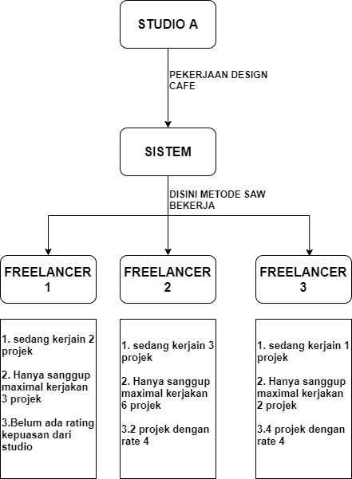

# Sistem Pendukung Keputusan Dengan Menggunakan Metode SAW - Medan Software

> PERANCANGAN SISTEM PENDUKUNG KEPUTUSAN PEMBAGIAN PROJEK DENGAN MENGGUNAKAN METODE SIMPLE ADDITIVE WEIGHTING (SAW) BERBASIS WEBSITE PADA PERUSAHAAN KAMISPACE

**Kriteria :** 

- Jumlah banyaknya proyek yg sedang di kerjakan (makin dikit makin besar kemungkinan dia dipilih)
- Kesanggupan dalam menerima berapa byk projek
- Nilai kepuasan dari pihak studio arsitek (makin bagus makin besar kemungkinan dia dipilih)

## Roles

**ADMIN**
- CRUD CRITERIA
- VIEW PROJECT

**STUDIO**
- CRUD PROJECT - {FINISH PROJECT, RATING PROJECT}
- PREVIEW OWN PROJECT

**FREELANCER**
- RECEIVE PROJECT NOTIFICATION
- PREVIEW OWN WORKING PROJECT

